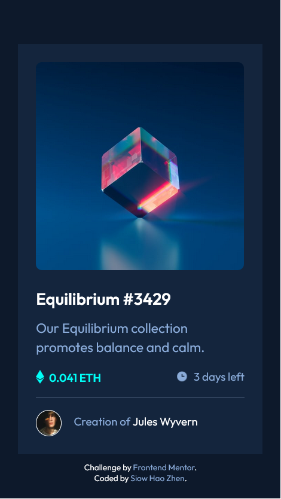

# Frontend Mentor - NFT preview card component solution

This is a solution to the [NFT preview card component challenge on Frontend Mentor](https://www.frontendmentor.io/challenges/nft-preview-card-component-SbdUL_w0U). Frontend Mentor challenges help you improve your coding skills by building realistic projects. 

## Table of contents

- [Overview](#overview)
  - [The challenge](#the-challenge)
  - [Screenshot](#screenshot)
  - [Links](#links)
- [My process](#my-process)
  - [Built with](#built-with)
  - [What I learned](#what-i-learned)
- [Author](#author)

**Note: Delete this note and update the table of contents based on what sections you keep.**

## Overview

### The challenge

Users should be able to:

- View the optimal layout depending on their device's screen size
- See hover states for interactive elements

### Screenshot

*Desktop*

*Mobile*

### Links

- Solution URL: [solution URL](https://github.com/HaoZhenSiow/Frontend-Mentor---NFT-preview-card-component-solution)
- Live Site URL: [live URL](https://haozhensiow.github.io/Frontend-Mentor---NFT-preview-card-component-solution/) 

## My process

### Built with

- Semantic HTML5 markup
- CSS custom properties
- Flexbox
- CSS Grid
- Mobile-first workflow
- Postcss

### What I learned

It is an easy task, straight forward.
1 thing I found out after completing this project:
`::after` and `::before` can only be inserted into the container such as `div`, `section`, `article` but not content such as `img` and `video`.

## Author

- Frontend Mentor - [@HaoZhenSiow](https://www.frontendmentor.io/profile/HaoZhenSiow)
